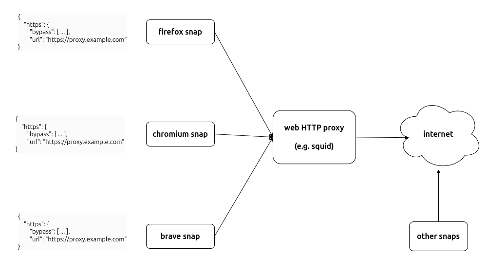
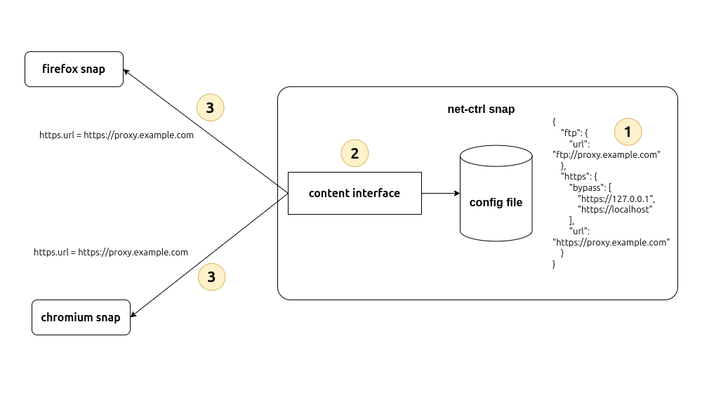
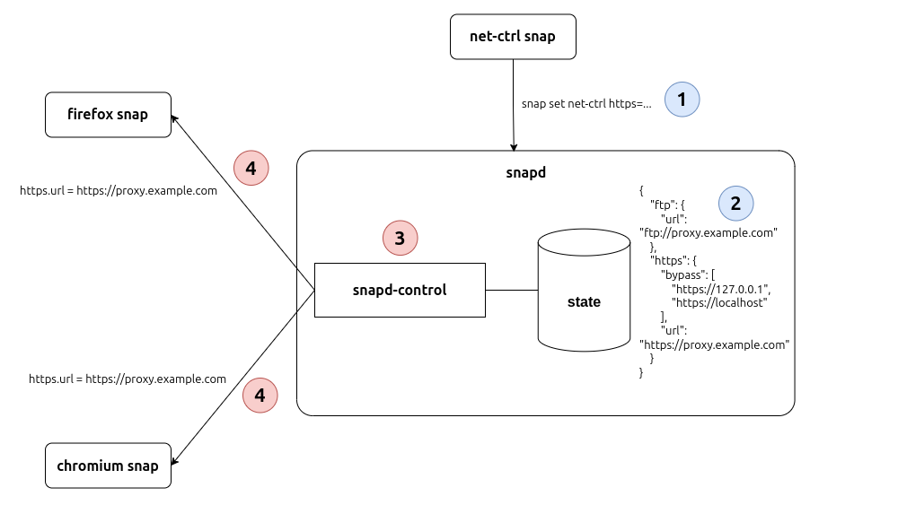
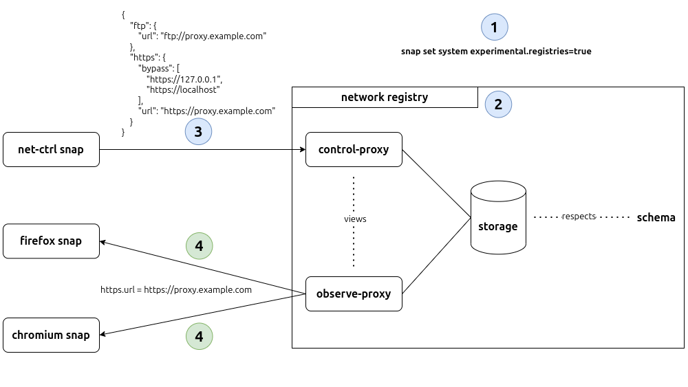

# A Registries* Demo

> *registries might be renamed

Registries provide a new mechanism for configuring snaps in the snappy ecosystem.

For this demo, we'll set up a `network` registry to share proxy configuration between snaps.

## The Past

Traditionally, snap configuration has been tightly coupled to individual snaps, making it difficult to share configuration between snaps. In this example, each of the snaps (firefox, chromium, & brave) have their own proxy config set through `snap set` which leads to a lot of duplication.



We'll look at several (somewhat hacky) workarounds to get around this and how registries can fix this.

### _content_ interface

In this scenario, we'll create an additional snap (`net-ctrl`) that will store the configuration in a file. It exposes this file to the other snaps over the [content interface](https://snapcraft.io/docs/content-interface).



### _snapd-control_ interface

In this scenario, we also have an additional snap (`net-ctrl`) that we set snap config on (with `snap set`). The other snaps then connect to the [snapd-control](https://snapcraft.io/docs/snapd-control-interface) and consume this configuration through the snapd API endpoint [`/v2/snaps/net-ctrl/conf`](https://snapcraft.io/docs/snapd-api#heading--snaps-name-conf). This is a BAD solution as it effectively grants these snaps `root` access to your device which isn't safe.



## Using Registries

### Intro

Registries separate snaps from their configuration, enabling easier cross-snap configuration sharing.\
A registry is defined using a `registry` assertion which looks like this:

```yaml
type: registry
authority-id: <account-id>
account-id: <account-id>
name: <string>
views:
  <view-name>:
    rules:
      -
        request: <string>
        storage: <string>
        access: read|write|read-write # the default is read-write
        content:
          -
            request: <string>
            storage: <string>
            ...
  ...
timestamp: <date -Iseconds --utc>

{
  "storage": {
    "aliases": {
      ...
    },
    "schema": {
      ...
    }
  }
}

<signature>
```

Snaps do not act on the the raw configuration in the storage directly. This is mediated by registry views which allows the views & storage to evolve independently.

We'll create two views: `control-proxy` and `observe-proxy`. `control-proxy` allows for `read-write` access but `observe-proxy` only allows `read` access. This is the naming convention in registries.

```yaml
views:
  control-proxy:
    rules:
      -
        content:
          -
            access: read-write
            request: url
            storage: url
          -
            request: bypass
            storage: bypass
        request: {protocol}
        storage: proxy.{protocol}
  observe-proxy:
    rules:
      -
        access: read
        request: https
        storage: proxy.https
      -
        access: read
        request: ftp
        storage: proxy.ftp
```

Each view has a set of rules that hold the `request` path, the underlying `storage`, and the `access` method. You can use placeholders in the `request` and `storage`. In the example above, `{protocol}` is a placeholder which maps to `proxy.{protocol}`. For instance, `https` -> `proxy.https`.

The stored config respects the following schema:

```json
{
  "storage": {
    "aliases": {
      "protocol": {
        "choices": [
          "http",
          "https",
          "ftp"
        ],
        "type": "string"
      }
    },
    "schema": {
      "proxy": {
        "keys": "$protocol",
        "values": {
          "schema": {
            "bypass": {
              "type": "array",
              "unique": true,
              "values": "string"
            },
            "url": "string"
          }
        }
      }
    }
  }
}
```

In a diagram, this setup looks like this:



The `net-ctrl` snap acts as the custodian of the registry view. A custodian snap can validate the view data being written using hooks such as `change-view-<plug>`.\
The other snaps are called "observers" of the registry view. They can use `<plug>-view-changed` hooks to watch changes to the view. This could be useful for the snaps to update their own config and/or restart runnning services.

The roles are defined as plugs in the respective snap's `snapcraft.yaml`. Like so:

**net-ctrl** (custodian)

```yaml
plugs:
  proxy-control:
    interface: registry
    account: <account-id>
    view: network/control-proxy
    role: custodian
```

**browser** (observer)

```yaml
plugs:
  proxy-observe:
    interface: registry
    account: <account-id>
    view: network/observe-proxy
```

### Create a `registry` Assertion

The registries feature is currently behind an experimental flag & you need to run `snap set system experimental.registries=true` to enable it.

You can create a registry assertion "by hand" where you sign it itself or you can use `snapcraft` which launches an editor to type the assertion in, then it signs the assertion & uploads it to the Store (see [this addendum](#creating-a-registry-assertion-with-snapcraft)).

Create a `network-registry.json` file and put your assertion there. Please note that the `body` must be in a _very specific_ format so run your json through `jq` like so: `echo '{...}' | jq -S | jq -sR`.

#### Sign & Acknowledge

Next, we'll sign the assertion, save the signed version in a `.assert` file, and finally acknowledge it.

```console
$ snap sign -k <key-name> network-registry.json > network-registry.assert
$ snap ack network-registry.assert
```

###### Errors You Might Encounter

**cannot resolve prerequisite assertion**

This errror occurs when trying to acknowledge the assertion but some requisite assertions are not found on the system. We'll need to fetch them from the Store.

To fetch and acknowledge the `account` assertion, run:

```console
$ snap known --remote account account-id=<account-id> > /tmp/account.assert
$ snap ack /tmp/account.assert
```

To fetch and acknowledge the `account-key` assertion, run:

```console
$ snap known --remote account-key public-key-sha3-384=<key-sha-digest> > /tmp/account-key.assert
$ snap ack /tmp/account-key.assert
```

Finally, `ack` the registry assertion itself.

### Build & Install Snaps

Next, we'll build and install the `net-ctrl` and `browser` snaps in this repository.

#### net-ctrl snap

```console
$ cd net-ctrl
$ snapcraft
Packed net-ctrl_0.1_amd64.snap

$ snap install net-ctrl_0.1_amd64.snap --dangerous
net-ctrl 0.1 installed
```

#### browser snap

```console
$ cd browser
$ snapcraft
Packed browser_0.1_amd64.snap

$ snap install browser_0.1_amd64.snap --dangerous
browser 0.1 installed
```

### Interfaces

Next, we'll connect the interfaces for both snaps.

```console
$ snap connect net-ctrl:proxy-control
$ snap connections net-ctrl
Interface  Plug                    Slot       Notes
registry   net-ctrl:proxy-control  :registry  manual

$ snap connect browser:proxy-observe
$ snap connections browser
Interface  Plug                   Slot       Notes
network    browser:network        :network   -
registry   browser:proxy-observe  :registry  manual
```

### Setting & Reading the Config

#### With `snapctl`

The commands take the form:
  - `snapctl set --view :<view-name> <dotted.path>=<value>`
  - `snapctl get --view :<view-name> [<dotted.path>] [-d]`

```console
$ sudo net-ctrl.sh -c 'snapctl set --view :proxy-control https.url=https://proxy.example.com'
$ sudo net-ctrl.sh -c 'snapctl set --view :proxy-control ftp.url=ftp://proxy.example.com'

$ snap run --shell browser
# snapctl get --view :proxy-observe
{
    "ftp": {
        "bypass": [
            "*://*.company.internal"
        ],
        "url": "ftp://proxy.example.com"
    },
    "https": {
        "bypass": [
            "localhost",
            "*://*.company.internal"
        ],
        "url": "https://proxy.example.com"
    }
}
# snapctl get --view :proxy-observe https
{
    "bypass": [
        "localhost",
        "*://*.company.internal"
    ],
    "url": "https://proxy.example.com"
}
```

#### With `snap set`

The commands take the form:
  - `snap set <account-id>/<registry>/<view> <dotted.path>=<value>`
  - `snap get <account-id>/<registry>/<view> [<dotted.path>] [-d]`

```console
$ snap set f22PSauKuNkwQTM9Wz67ZCjNACuSjjhN/network/control-proxy 'https.bypass=["https://127.0.0.1", "https://localhost"]'

$ snap get f22PSauKuNkwQTM9Wz67ZCjNACuSjjhN/network/observe-proxy ftp
Key         Value
ftp.bypass  [*://*.company.internal]
ftp.url     ftp://proxy.example.com
$ snap get f22PSauKuNkwQTM9Wz67ZCjNACuSjjhN/network/observe-proxy ftp -d
{
    "ftp": {
        "bypass": [
            "*://*.company.internal"
        ],
        "url": "ftp://proxy.example.com"
    }
}
$ snap get f22PSauKuNkwQTM9Wz67ZCjNACuSjjhN/network/control-proxy ftp.url
ftp://proxy.example.com
```

Please note that using `snap set` with registries doesn't seem to run the hooks.

## Hooks

### browser/proxy-observe-view-changed (`<plug>-view-changed`)

This hook allows the browser snap to watch for changes to the `observe` proxy view. It outputs the new config to `$SNAP_COMMON/new-config.json`.

```console
$ sudo net-ctrl.sh -c 'snapctl set --view :proxy-control https.url="http://localhost:3199/"'
$ snap changes
ID   Status  Spawn                     Ready                     Summary
[...]
765  Done    today at 15:36 CET        today at 15:36 CET        Modify registry "f22PSauKuNkwQTM9Wz67ZCjNACuSjjhN/network"
$ snap tasks 765
Status  Spawn               Ready               Summary
Done    today at 15:36 CET  today at 15:36 CET  Clears the ongoing registry transaction from state (on error)
Done    today at 15:36 CET  today at 15:36 CET  Run hook change-view-proxy-control of snap "net-ctrl"
Done    today at 15:36 CET  today at 15:36 CET  Run hook proxy-observe-view-changed of snap "browser"
Done    today at 15:36 CET  today at 15:36 CET  Commit changes to registry "f22PSauKuNkwQTM9Wz67ZCjNACuSjjhN/network"
Done    today at 15:36 CET  today at 15:36 CET  Clears the ongoing registry transaction from state
$ cat /var/snap/browser/common/new-config.json
{
    "ftp": {
        "bypass": [
            "*://*.company.internal"
        ],
        "url": "ftp://proxy.example.com"
    },
    "https": {
        "bypass": [
            "https://127.0.0.1",
            "https://localhost",
            "*://*.company.internal"
        ],
        "url": "http://localhost:3199/"
    }
}
```

### net-ctrl/change-view-proxy-control (`change-view-<plug>`)

This hook:
1. Validates the `{protocol}.url` (data validation), and
2. Ensures that internal company URLs are never proxied (data decoration).

#### Example 1

```console
$ sudo net-ctrl.sh -c 'snapctl set --view :proxy-control https.url="not a url?"'
$ snap changes
ID   Status  Spawn                     Ready                     Summary
[...]
766  Error   today at 15:38 CET        today at 15:38 CET        Modify registry "f22PSauKuNkwQTM9Wz67ZCjNACuSjjhN/network"
$ snap tasks 766
Status  Spawn               Ready               Summary
Undone  today at 15:38 CET  today at 15:38 CET  Clears the ongoing registry transaction from state (on error)
Error   today at 15:38 CET  today at 15:38 CET  Run hook change-view-proxy-control of snap "net-ctrl"
Hold    today at 15:38 CET  today at 15:38 CET  Run hook proxy-observe-view-changed of snap "browser"
Hold    today at 15:38 CET  today at 15:38 CET  Commit changes to registry "f22PSauKuNkwQTM9Wz67ZCjNACuSjjhN/network"
Hold    today at 15:38 CET  today at 15:38 CET  Clears the ongoing registry transaction from state

......................................................................
Run hook change-view-proxy-control of snap "net-ctrl"

2024-10-30T17:38:59+03:00 ERROR run hook "change-view-proxy-control": failed to validate url: not a url?
```

#### Example 2

```console
$ sudo snap run --shell net-ctrl.sh
# snapctl set --view :proxy-control 'https.bypass=["localhost"]'
# snapctl get --view :proxy-control
{
    "ftp": {
        "bypass": [
            "*://*.company.internal"
        ],
        "url": "ftp://proxy.example.com"
    },
    "https": {
        "bypass": [
            "localhost",
            "*://*.company.internal"
        ],
        "url": "http://localhost:3199/"
    }
}
```

## Addendum

### Creating a Registry Assertion with Snapcraft

Register for an Ubuntu One (staging) account [here](https://login.staging.ubuntu.com/) and for a Store (staging) account [here](https://dashboard.staging.snapcraft.io/).

We need to use staging since the registries API is disabled on production:

```console
$ snapcraft edit-registries <account-id> network --key-name=<key-name>
Store operation failed:
- feature-disabled: Registries API is disabled
```

#### Login

```console
$ export UBUNTU_ONE_SSO_URL="https://login.staging.ubuntu.com"
$ export STORE_DASHBOARD_URL="https://dashboard.staging.snapcraft.io"
$ snapcraft login
```

#### Setup Keys

```console
$ snapcraft create-key <key-name>
$ snapcraft register-key <key-name>
```

#### Create a New Registry

```console
$ snapcraft whoami
email: <email>
username: <username>
id: <account-id>
permissions: package_access, package_manage, package_metrics, package_push, package_register, package_release, package_update
channels: no restrictions
expires: 2025-10-25T08:38:11.000Z

$ snapcraft edit-registries <account-id> network --key-name=<key-name>
Successfully created revision 1 for 'network'.

$ snapcraft list-registries
Account ID                        Name      Revision  When
<account-id>                      network          1  2024-10-2
```

#### API

The API documentation is available [here](https://dashboard.snapcraft.io/docs/reference/v2/en/registries.html).\
Install [surl](https://snapcraft.io/surl) to interact with it.

```console
$ surl -a staging -s staging -e <email>
{
  "account": {
    "id": "<account-id>",
    "email": "<email>",
    "username": "<username>",
    "name": "<your name>"
  },
  "channels": null,
  "packages": null,
  "permissions": [
    "package_access"
  ],
  "store_ids": null,
  "expires": "2025-04-23T00:00:00.000",
  "errors": []
}

$ surl -a staging https://dashboard.staging.snapcraft.io/api/v2/registries | jq
{
  "assertions": [
    {
      "headers": {
        "account-id": "<account-id>",
        "authority-id": "<account-ids>",
        "body-length": "92",
        "name": "network",
        "revision": "1",
        "sign-key-sha3-384": "RFxSEcXp9jocWM85Hm9m62JOtXKvu1k5toUXUZ6RGw20Md3WlZaf7P-SpZ_ed1wD",
        "timestamp": "2024-10-25T08:55:22Z",
        "type": "registry",
        "views": {
          "wifi-setup": {
            "rules": [
              {
                "access": "write",
                "request": "ssids",
                "storage": "wifi.ssids"
              }
            ]
          }
        }
      },
      "body": "{\n  \"storage\": {\n    \"schema\": {\n      \"wifi\": {\n        \"values\": \"any\"\n      }\n    }\n  }\n}"
    }
  ]
}
```

### Checking if the `browser` snap works

Run a docker container on the host (`proxy.example.com`) or locally:

```console
$ docker run -d --name squid-container -e TZ=UTC -p 3128:3128 ubuntu/squid:5.2-22.04_beta
```

```console
$ sudo net-ctrl.sh -c 'snapctl set --view :proxy-control https.url="http://localhost:3128/"'
$ browser "https://example.com"

╭──────────────────────────────────────────────────────────────────────────────────────────────╮
│                                        Example Domain                                        │
╰──────────────────────────────────────────────────────────────────────────────────────────────╯


This domain is for use in illustrative examples in documents. You may use this domain in
literature without prior coordination or asking for permission.


More information... (https://www.iana.org/domains/example)

```

```console
$ docker logs -f squid-container
[...]
1729879108.361   2812 172.17.0.1 TCP_TUNNEL/200 5435 CONNECT example.com:443 - HIER_DIRECT/93.184.215.14 -
1729879154.849   1618 172.17.0.1 TCP_TUNNEL/200 5458 CONNECT example.com:443 - HIER_DIRECT/93.184.215.14 -
```
